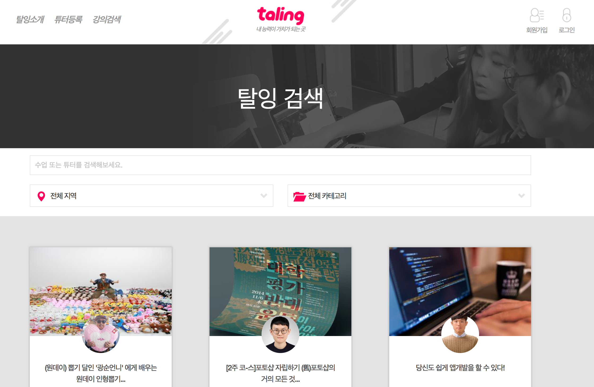
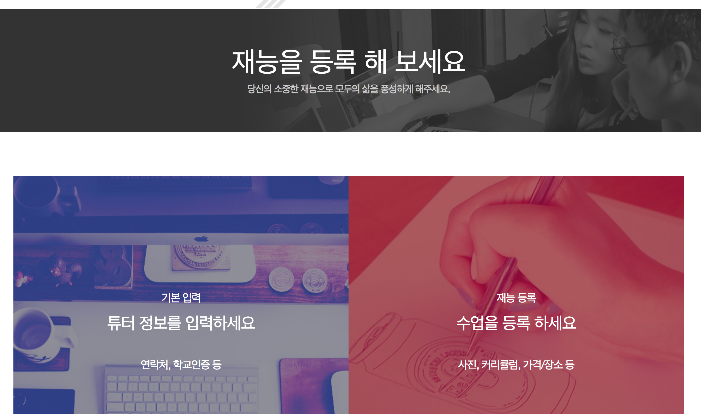
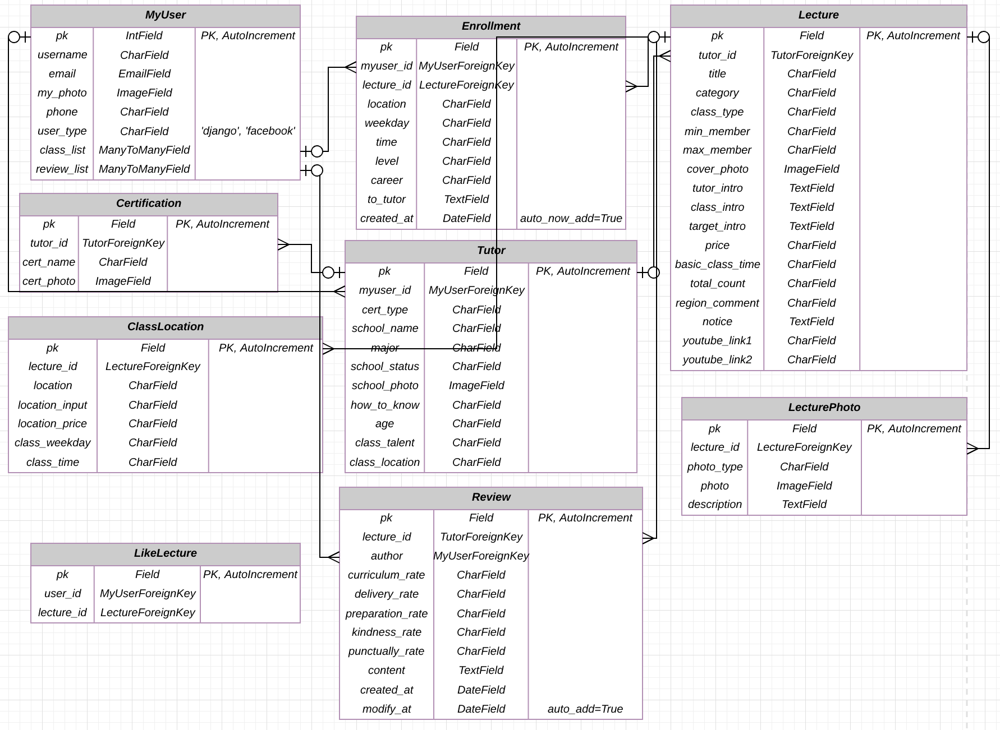

# 6조

김용연, 김희진

---

## 목차

1. 프로젝트에 대한 개요
2. 기능과 구조
3. 프로젝트 일정
4. 역할 분담과 각오
5. QnA

---

## 1. 프로젝트에 대한 개요

> #### 탈잉(Taling) : 탈출잉여시간

"소파에 누워 핸드폰 보는 **잉여시간을 탈출** 시켜보자!"
#### 목표
- 탈잉 서비스의 핵심 기능 위주로 백엔드를 구현한다.

#### 1차 모델링
- 약간의 변동이 있을 수 있습니다.

---

## 2. Information Architecture

![Information_Architecture]
(https://raw.github.com/yykdev/WPS-TeamProject-Taling/master/.description/images/02_01_Information_Architecture.png)

####1. 회원가입
 - 페이스북 회원가입
 - 이메일 회원가입

####2. 로그인
 - 페이스북 로그인
 - 이메일 로그인

####3. 강의정보
 - 강의 정보 검색
 - 강의 리스트

####4. 마이페이지
 - 회원정보 수정
 - 튜터 등록하기
 - 내가 등록한 강의보기
 - 내가 신청한 강의보기 
 
 
---

## 3. 프로젝트 일정
#### 1주차 : 모델링 및 서버 구축

#### 2주차 : 핵심 기능 구현 1
- 로그인, 회원가입 기능 구현 (소셜로그인 포함)
- 강의 리스트, 강의 등록하기
- API, TDD 포함

#### 3주차 : 핵심 기능 구현 2, 테스트
- 튜터 등록하기, 찜하기, 리뷰 및 별점
- 필요시 기능 추가
- API, TDD 포함

#### 4주차 : 문서 작성과 최종 발표 준비

---

## 4. 역할 분담
> **공통** : 모델링, 서버 배포, TDD, API
- 로그인/회원가입, 찜하기, 리뷰/별점 : 김희진
- 강의 리스트, 강의 등록, 튜터 등록 : 김용연  

---

## 5. QnA

1. 프론트엔트 측에서 탈잉을 전체 카피하는 것이 아닌 최소한의 핵심 기능만 구현하자고 의견을 모았는데요, 개인적으로 탈잉 자체가 그렇게 기능이 많은 것은 아니여서 거기서 더 줄이는 것이 아쉬운 감이 있습니다. 그렇다면 더 구현하고 싶은 부분이나 그 외 추가하고 싶은 기능이 있다면, 이번 팀 프로젝트에서 해보는 것이 나을지, 아니면 개인적으로 해보는 것이 나을지에 대한 조언 부탁드립니다. 
 
2. 페이스북 로그인은 패스워드를 따로 받아오지 않는데요, rest_auth는 username과 password를 요구합니다. 페이스북 로그인으로 rest_auth 토큰을 받을 수 있나요?

## 기타
 - 다른 스쿨은 배제한 상태로 bootstrap, Jquery/Ajax 등을 이용하여 별도 UI 개발 예정